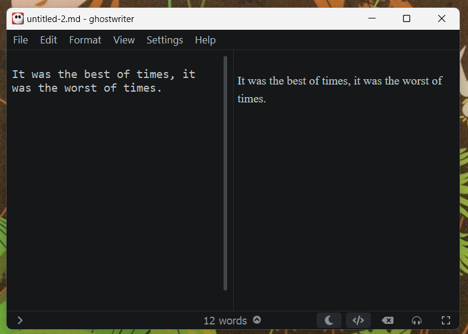
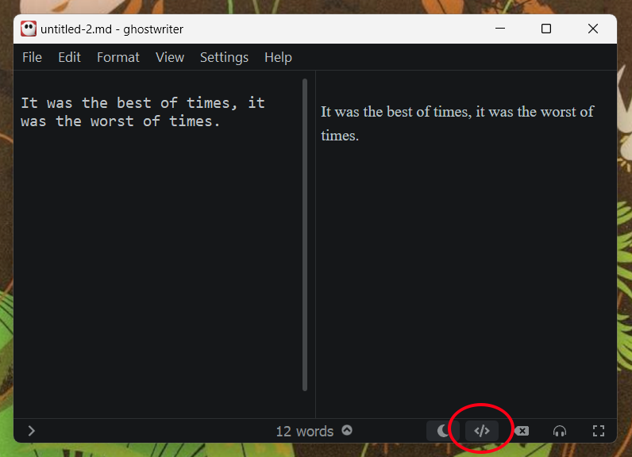
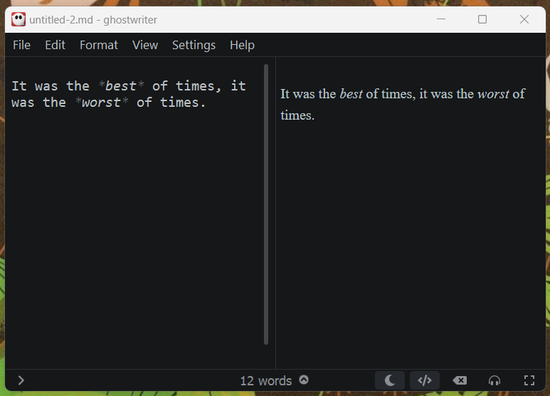
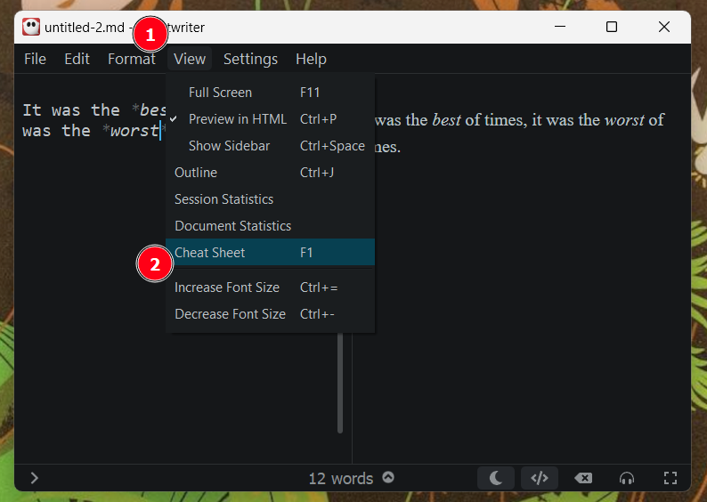
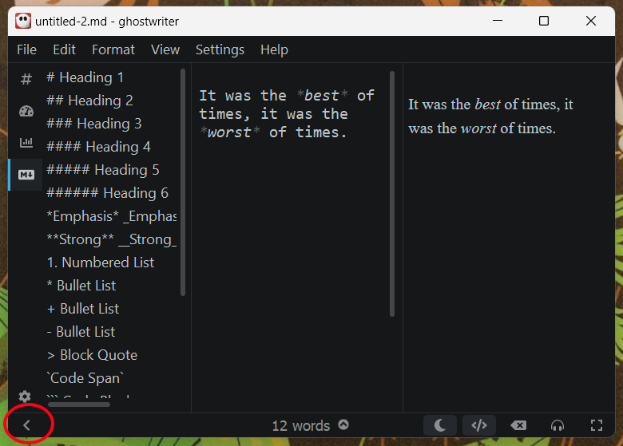
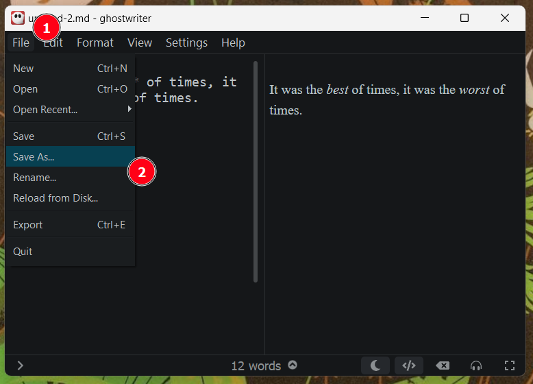
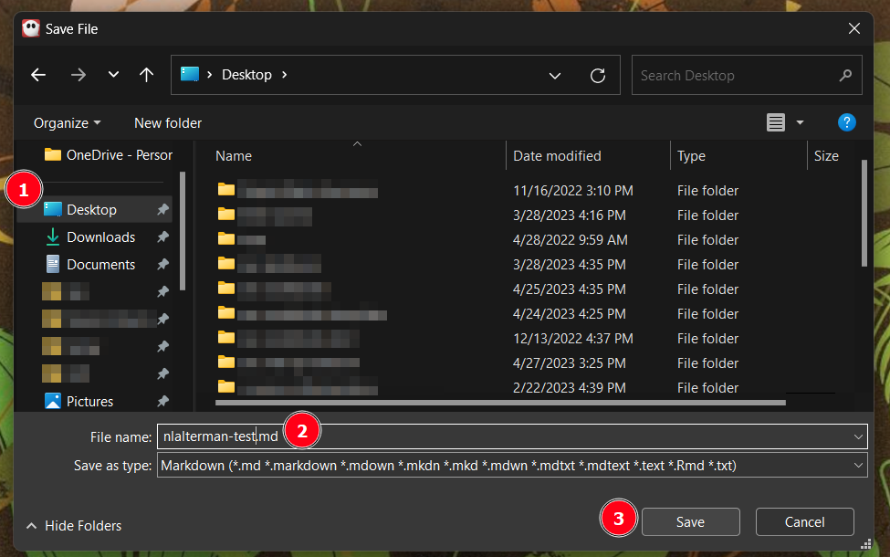
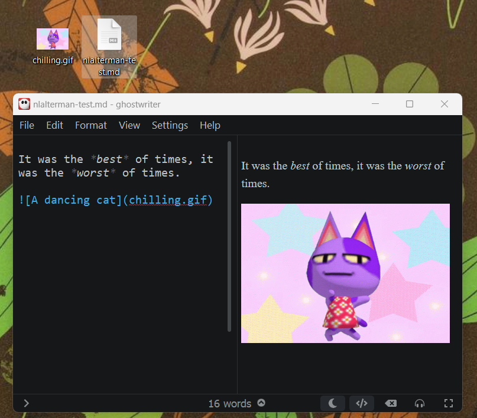

# 1. Markdown

In this chapter, we'll learn how to use a graphical text editor that specializes in Markdown documents.

## Opening the editor

Although we can write markdown in almost any text editor, today we will be using [Ghostwriter](https://ghostwriter.kde.org/). We choose this editor because it gives us practice seeing Markdown source and rendered output side-by-side, as well as providing us with some useful cheat sheets.

For the computers in this lab, start by navigating to the folder `C:\BIN\ghostwriter_2.1.6_win64_portable`. You can do this by opening the start menu, typing Run, and hitting enter. At the run prompt, paste the aforementioned file path and click `OK`:

[TODO]

Once there, double click `ghostwriter.exe`, circled here in red:

[TODO]

If you see a screen saying that Windows protected your computer from an untrusted program, ask your workshop administrators for help.

## Basic editing

In GhostWriter, we write Markdown **source** on the left and see a **preview** of the final typeset document on the right. Select the source pane by clicking the left side of the window, and typing some content into it:



If the nicely rendered version on the right disappears, we can bring it back by clicking the "Toggle Live HTML Preview" button at the bottom, circled here in red:



Now try making some words italic by surrounding them with asterisks (`*`):



Having trouble making changes to the content? Make sure the "source" side of the window is selected by clicking on it.

Want to see what else we can do with Markdown? Open the cheat sheet by selecting the `View menu` (1) and then `Cheat Sheet` (2):



This will open a sidebar showing us examples of how to format text conforming to Markdown standards. We can close the side bar by clicking the little arrow icon in the bottom-left, circled here in red:



## Save our work

Let's save our work to the desktop. Selecting the `File menu` (1) and click `Save As` (2). 



In the dialog window that appears, select the `Desktop` from the bar on the left (1), and specify a filename that includes your UW username (2). Note that markdown filenames most commonly end with the suffix `.md`. Finally, click the `Save` button (3):



## Inserting images

We can add images to our markdown document by using Windows Explorer to copy the desired image files into the same folder as the markdown source (the `.md` file), and then writing this in the document where we would like the image to appear:

```markdown

```

Replace `description` with a human-readable description of the image content, and `name-of-image-file` with the filename as seen in Windows Explorer:



