# 3. Git Branches

In this chapter, we'll learn how to travel back in time and make changes to previous versions of our document using git branches

## Review

Let's recall what we were doing in the last chapter. We had created a repository, copied a markdown file (and possibly an image) into it, and then recorded that initial moment in history with a first commit. Then, we modified the markdown file, saved those changes, and recorded them in the historical timeline with a *second* commit. From the 'Commits' screen in GitFiend, we can see both of those commits arranged with the newest at the top and the oldest at the bottom:

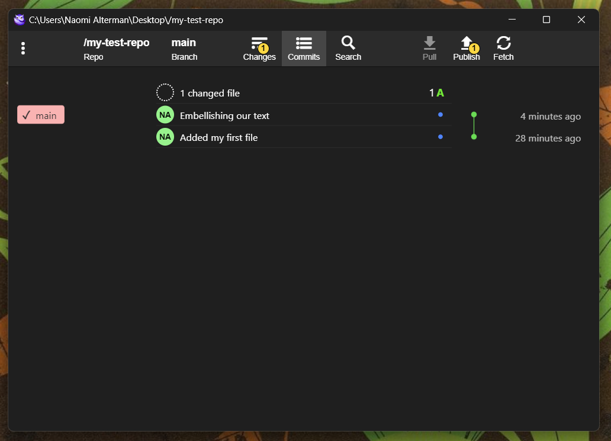

We can click a commit description to see more details about what changes were made at that point in time.

## Going back in time

What if we want to view a file as it used to be in the past, *outside* of the GitFiend window? Let's say, look at the original version of our Markdown document?

To do so, we have to create a *branch* from a previous commit in history. This is a parallel version of history diverging from the main timeline, in which we'll see old versions of the repo's files and can make new changes to them that differ from the files' most "recent" versions.

Let's branch the timeline starting from the first commit. Click the blue dot on the right side of the commit at the bottom of the list (1), and then click "Create Branch Here..." (2):

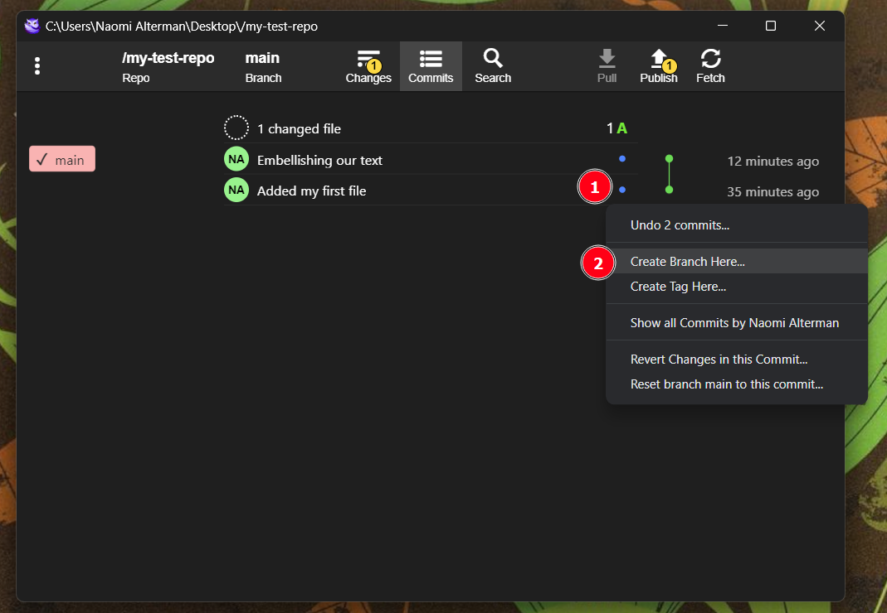

Give the branch a name without any spaces in it, let's call it `alternate-timeline` (1), and then click OK (2):

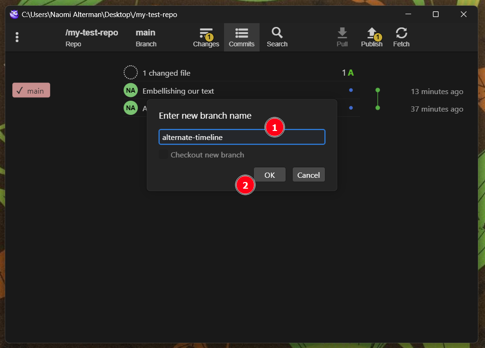

We'll see something new appear on the screen. GitFiend displays the names of branches like little post-it notes on the left side of the commit timeline. These post-its always appear next to the most recent commit from *their* version of history. According to this screen, the branched timeline called "alternate-timeline" never progressed beyond the commit "Added my first file", while the main timeline observed our subsequent file changes:

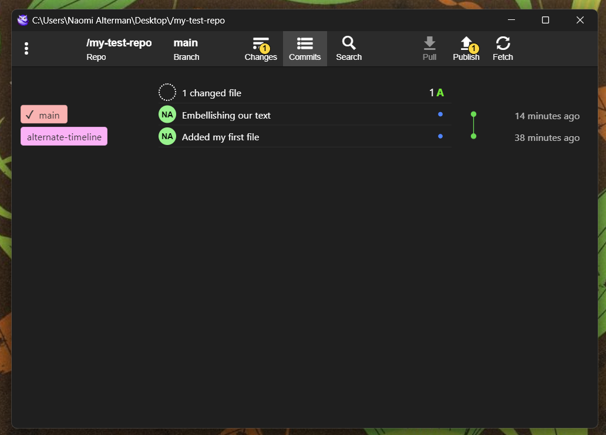

Now, let's actually time travel. We can change the state of our repository to reflect the "head" of the timeline from one branch or another by "checking out" a branch. Click the "Branch" button at the top of the screen (1) to open up a detailed list of all timeline branches of the repository. Now, click the `alternate-timeline` postit (2), and click `Checkout` (3):

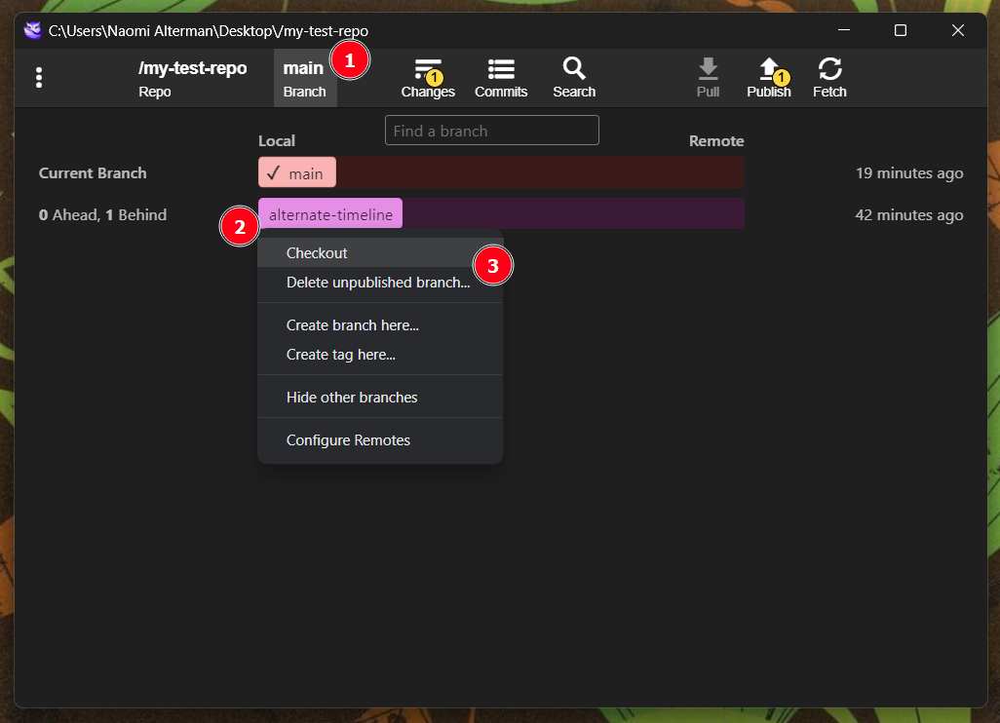

After a moment, all files in the repository folder will have reverted back to their original contents.

If we return to GhostWriter, we'll see that the document we had opened was modified by "another program". That program was GitFiend, rewriting the document to look as it initially did in that first repo commit. Select 'Yes' to reload the document as GitFiend now sees it:

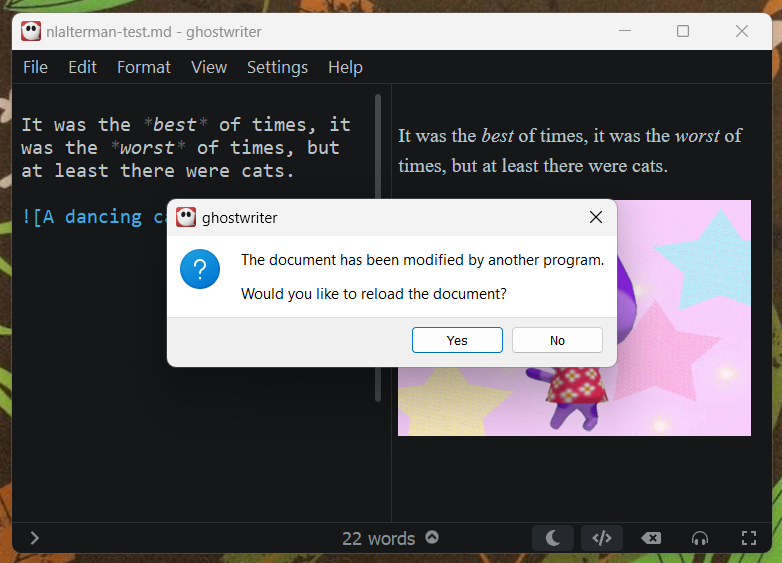

If this notification had *not* appeared, we could manually re-load the document by selecting the `File` menu and then `Reload from disk...`

Now, let's make a different change to the document. At the very end, let's add another line of text and then save by pressing `Control + S`:

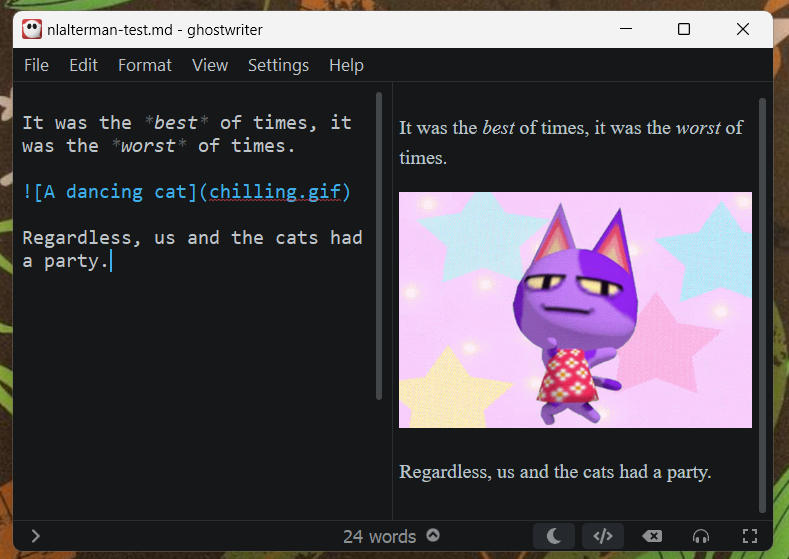

Let's return to GitFiend and click on the `Changes` button:

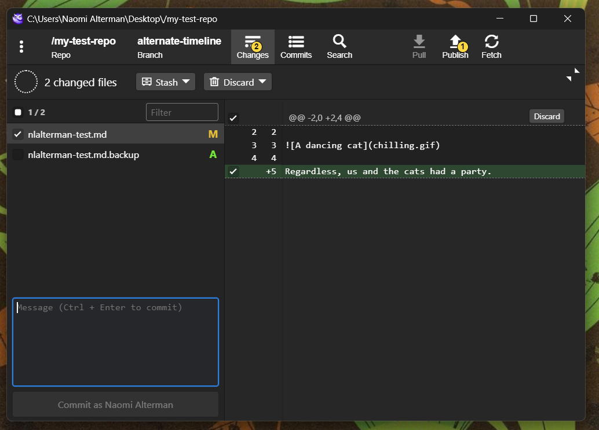

We can see our changes in the diff (the pane on the right).

Type out a commit message and click Commit.

Then, select the `Commits` button at the top of the window to return to the timeline view:

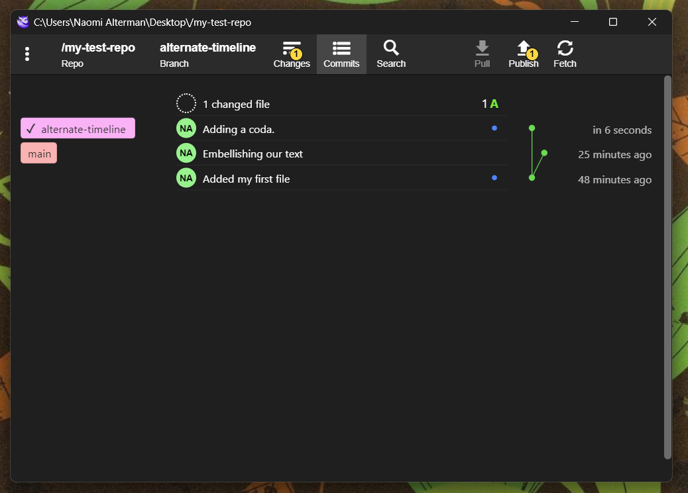

Observe the green lines on the right side of the commit list. These indicate the diverging paths that branches have taken over time. The `main` branch moves from the initial commit "Added my first file" to the second commit "Embellishing our text". The `alternate-timeline` branch, however, moves from "Added my first file" to "Adding a coda." These are different paths through history, indicating an original text that evolved into two different documents.

We can return to the main timeline by clicking the Branch button at the top of the window again (1), clicking `main`(2), and clicking `Checkout`:

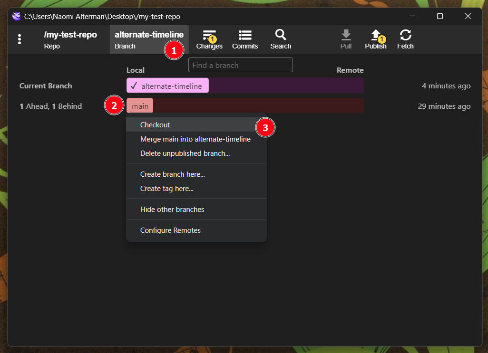

Note that the checkmark moves from `alternate-timeline` to `main`, indicating our files now reflect the state of the world on that branch.

Finally, let's merge these two disparate timelines back into one again.

Click `alternate-timeline` (1) and select `Merge alternate-timeline into main` (2) :

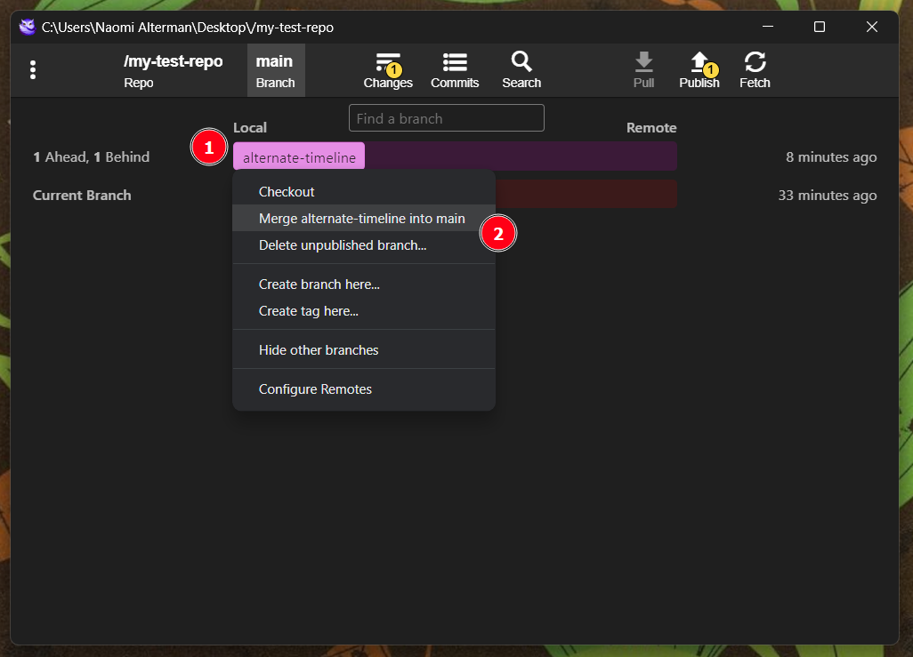

This takes the changes from the alternate timeline and **merges** them together with the changes in the main timeline, so that the main timeline now reflects all of the modifications we made. Check it out on the `Commits` screen:

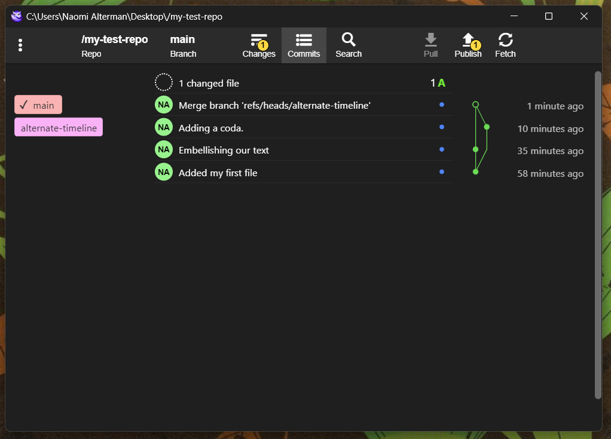

Inspecting the green graph on the right hand side, we can see that time diverged back at the initial commit into two branches: main and alternate-timeline. Subsequently, different changes were made to the document. Finally, we merged the alternate timeline *back* into main, and now the changes made within all the commits on the screen are present in our working document.

Let's confirm that by returning to Ghostwriter and selecting `File`, then `Reload from disk...`:

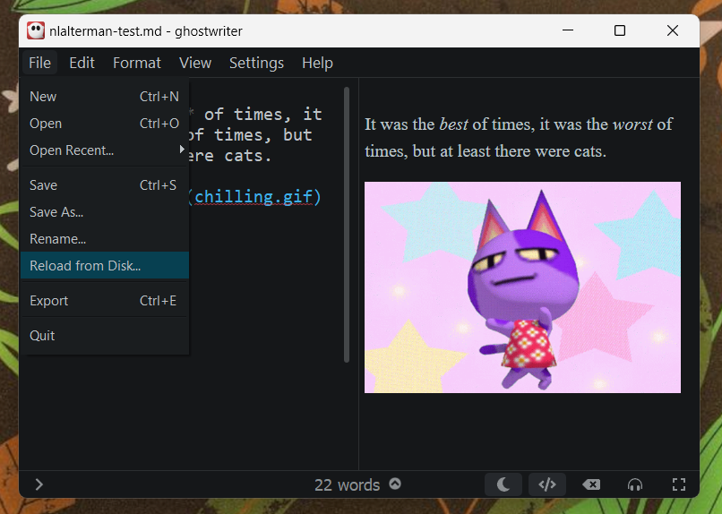

And we can see the final version of our text, containing both of our changes, is present:

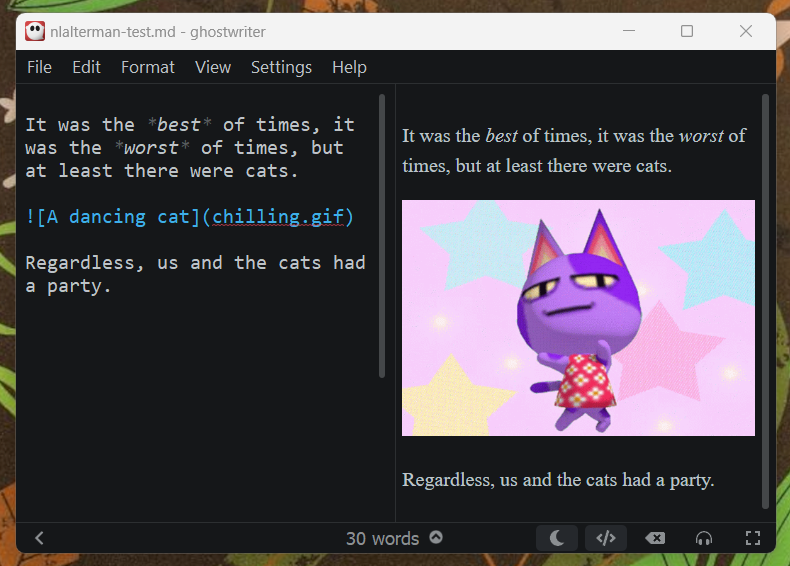
