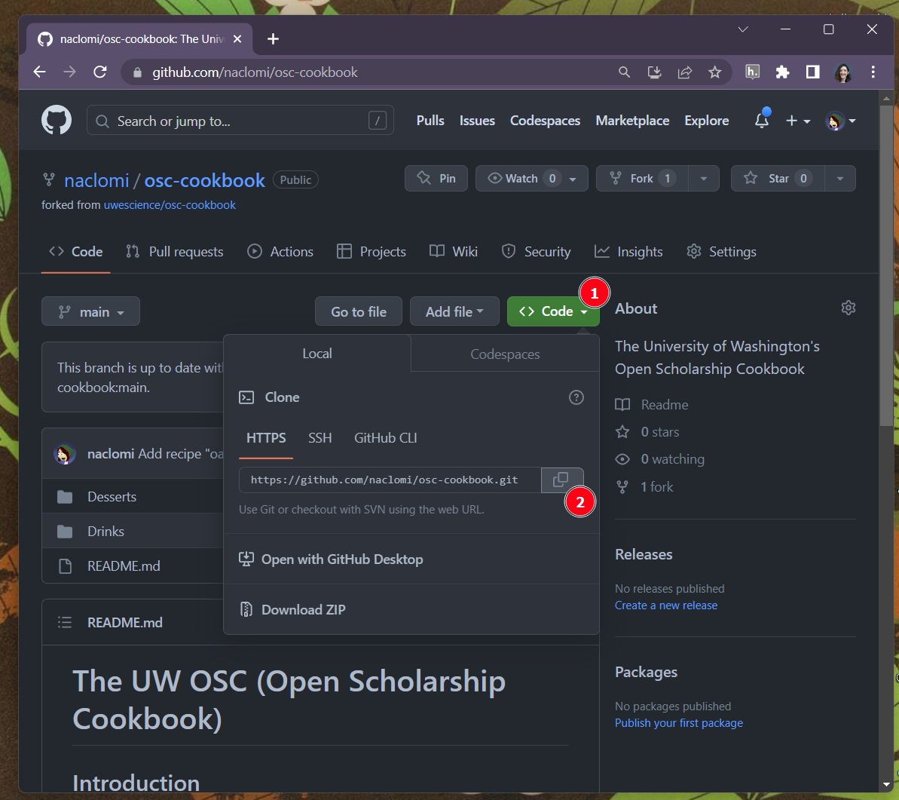
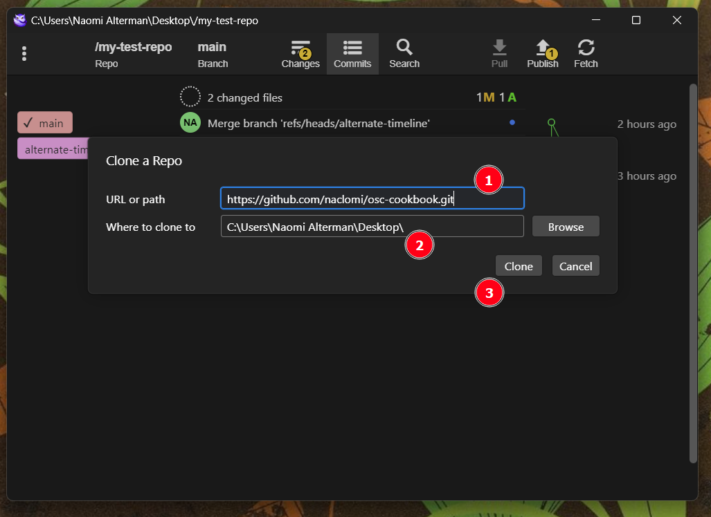

# 4. Intro to GitHub

In this chapter, we'll learn how to collaborate with multiple colleagues on the same repository using the commercial repo host *GitHub*

## Create a GitHub account

If you already have a GitHub account, you can just log in and then skip forward to the section "[Fork the cookbook repository](#Fork-the-cookbook-repository)"

In a new tab in your web browser, go to the URL "[https://github.com/signup](https://github.com/signup)"


Follow the instructions to create a new GitHub account. While your email address will not be publicly visible, the rest of your GitHub account will be. If you would like to ensure your privacy, feel free to use a pseudonym.

After doing finishing the sign-up guide, GitHub will send a verification message to the email address you provided. You **must** open that message and click the link within it to finish creating your account, otherwise you will not be able to proceed with the rest of this guide.

## Fork the cookbook repository

Take a look at the repository that contains our collaborative cookbook by opening the following URL in your web browser:

(https://github.com/uwescience/osc-cookbook.git)[https://github.com/uwescience/osc-cookbook.git]

On this page, GitHub is showing us a read-only view of the files in the repository. The pane labeled (1) is the folder tree we might see if we opened the repository in Windows Explorer. If there is a Markdown file named `README.md` in the root folder of the repository, it will be displayed in the pane labeled (2). We can view the timeline of commits in the repository by clicking the clock icon at (3), and we can view all of the different timeline branches by clicking (4):


Finally, there's the Fork button (5) at the top of the page. **Forking** a repository on GitHub means making a copy of its contents that you have permission to modify. You can think of forking a repository as being analogous to your friend giving you a page-for-page photocopy of a book they've been annotating with a pencil. You now have access to a copy of the book, along with the notes that were present when the copy was made.

So, let's click that Fork button. This will bring us to a page that gives us the opportunity to choose a new name for our fork, along with a few other settings. Leave everything as-is, and click the green 'Create fork' button at the bottom of the page, circled in red here:


After a minute or so, you'll be sent to the landing page for *your* copy of the repository. Note that the name at the top of the screen now reflects that this version of `osc-cookbook` lives within your user account's purview, rather than the eScience Institute's:


We have more flexibility to add and change files from GitHub's website, but we're going to download the repository to our computer so we can work with the tools we've been learning so far.

##  Cloning the repository

To download these files to our computer, we're going to create a **clone** of it using GitFiend. First off, click that green `<> Code` button (1), and then click the Copy icon (2) on the box that pops up:



This copies that text ending with '.git' to your clipboard. This is our repository's "code URL", which we can give to GitFiend.

Let's hop over to GitFiend. Click the "Repo" button (1) at the top to select a different repository, and then click "Clone Repo..." (2) :


In the window that pops up, paste in the URL we copied from GitHub by clicking the URL box and then typing `Control + V`  (1). Make sure that the repository is going to be downloaded to your Desktop (2), and then click Clone (3):



In a moment, you should see the commit timeline for our shared cookbook appear (note that, depending on how many editions of the cookbook we've published, you may see more commits on your timeline than what's in the following screenshot 😊 ! ):


Cloning and forking repositories are quite similar actions; indeed, they're *almost* synonyms (but not quite). For our purposes:

- **Forking** a repo is the process of taking a repository on GitHub and making a copy of it that is *also* on GitHub
- **Cloning** a repo is the process of taking a repository on GitHub and making a copy of it on our local computer

Since it's now on our local computer, we should be able to find its folder on our desktop and open it with Windows Explorer:


## Making local changes

At this point, we can work with the files in this repository just like we did our test repo from previous chapters. Let's start by copying our recipe's markdown file from the desktop into the appropriate folder. Here, we've copied a brownies recipe into the 'Desserts' folder:


If we had a recipe that didn't fit into any of the pre-existing categories, we could have just created a new folder to house it (say, a `Noodles` folder to hold our spaghetti recipe). 

Anyway, now that we've copied our recipe into the repo, let's create a link to it from the table of contents. Use Ghostwriter to open the `README.md` file in the root directory of the repository:


Scroll down to the area in the table of contents that you would like to list your recipe, and add a link to it using Markdown link syntax:

```markdown
[link name](link URL)
```

In this case, the link name will be the name of your recipe, and the link URL will be the path to your recipe's markdown file relative to the current document. So, if we put a recipe called `brownies.md` in the `Desserts` folder, the link URL will be `Desserts/brownies.md`:


You can try clicking the link in the preview to check that you've got the URL correct.

Once you're done, save the file by pressing `Control + S` and return to GitFiend.

Go to the Changes screen and "inspect the diff" (1) -- that is, look at the changes you're about to commit to the repository and confirm you are happy with them. You can always go back and change typos before you commit, but anything you don't catch will be committed to the document history forever! Next, uncheck the Ghostwriter ".backup" file from the files list (2) so that it will not be included in the commit. Write a commit message explaining what your changes entail (3), and finally click the Commit button (4): 


Now let's return to the 'Commits' screen:


We'll now see our contributions reflected on the commit timeline.

