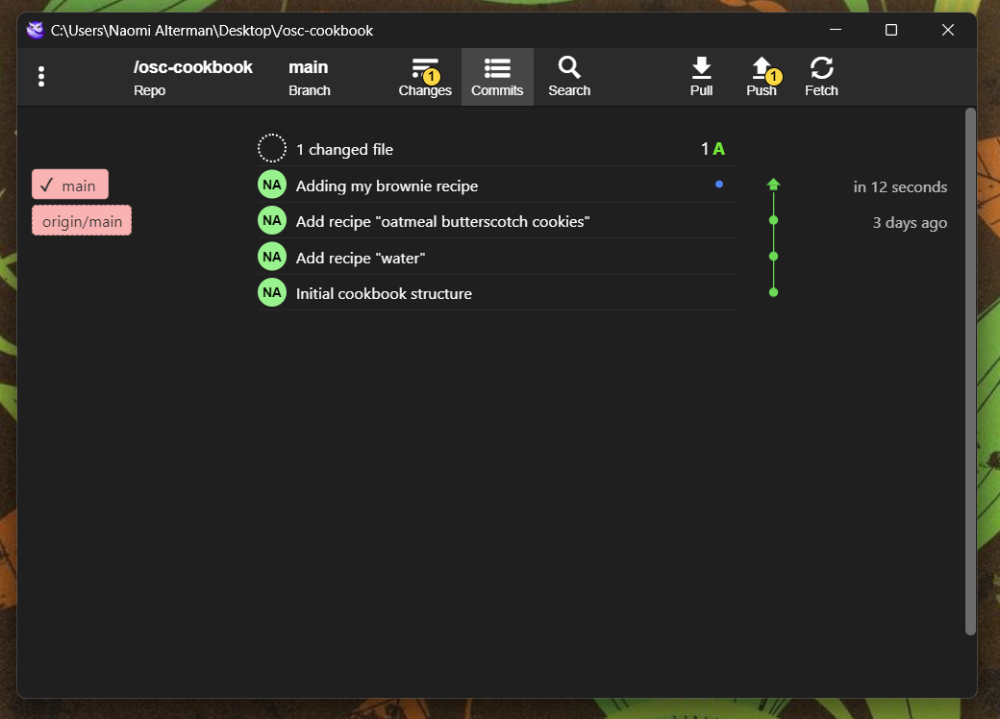
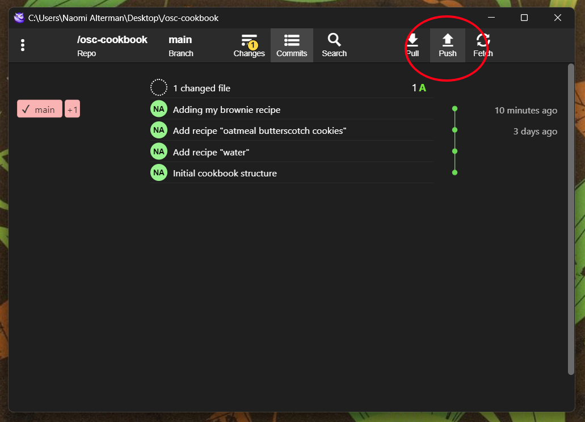
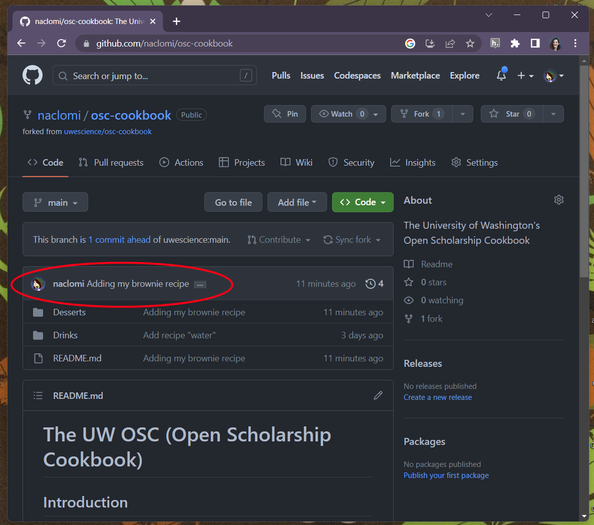
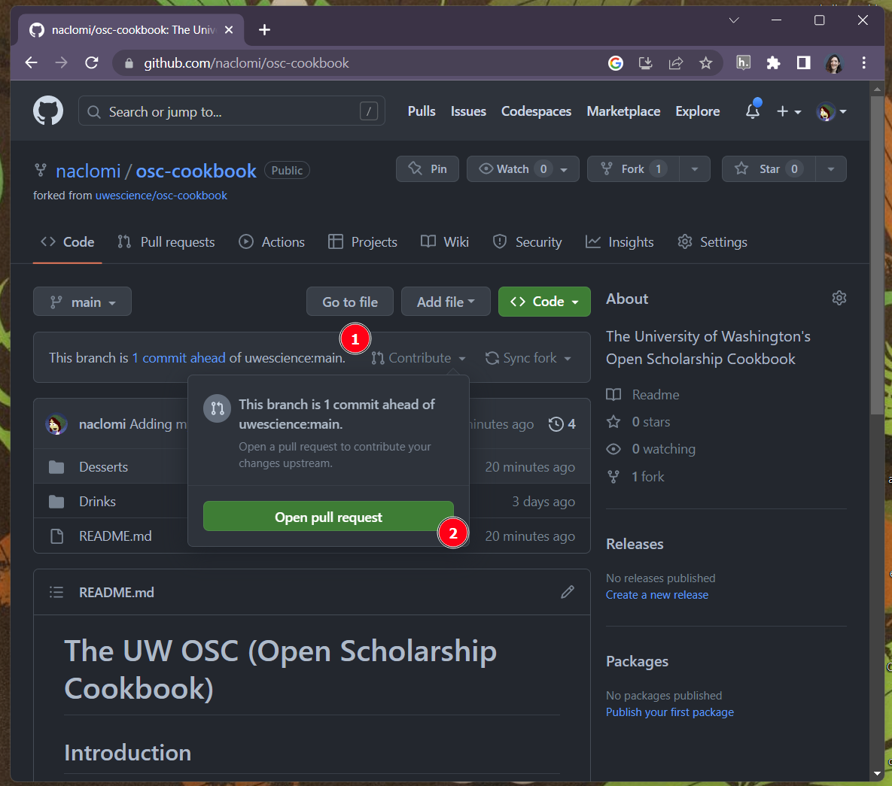
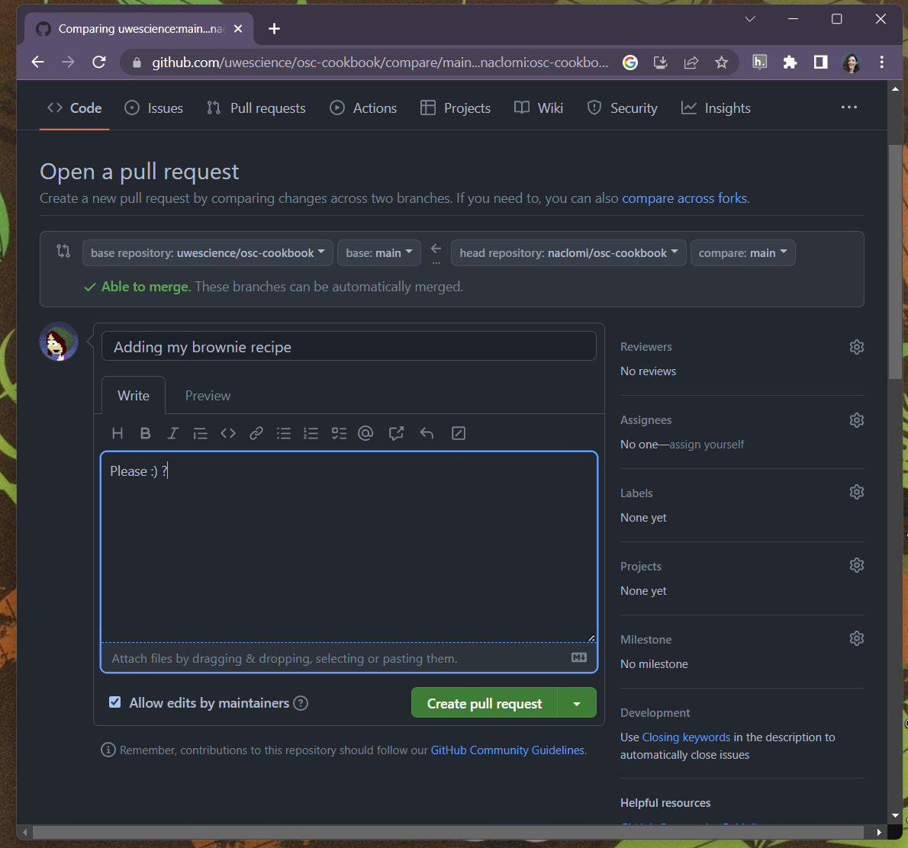
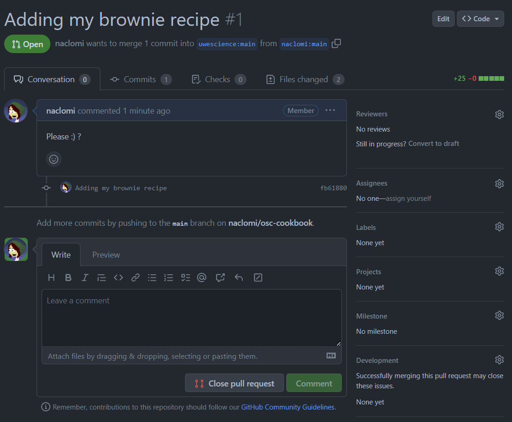
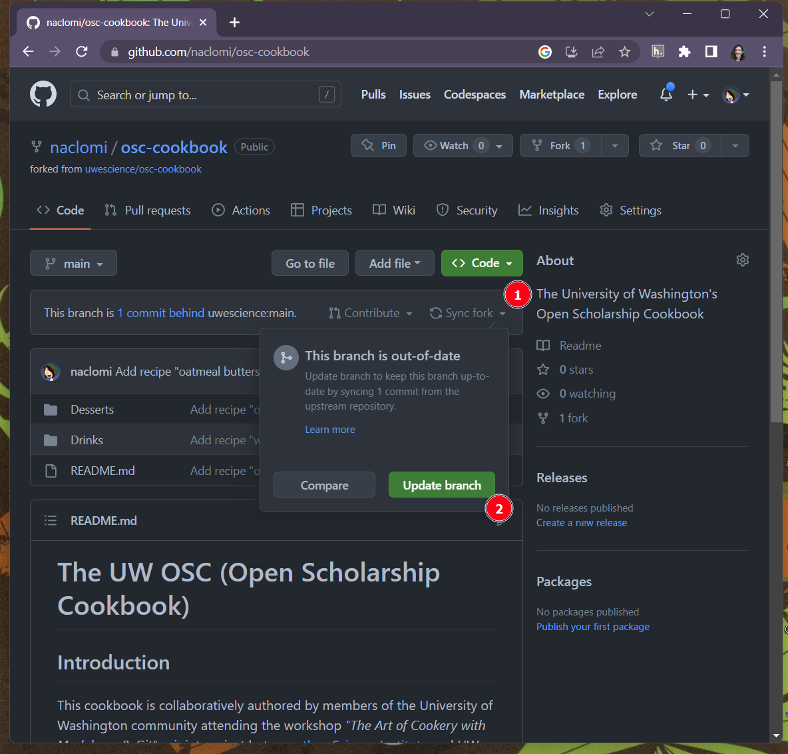
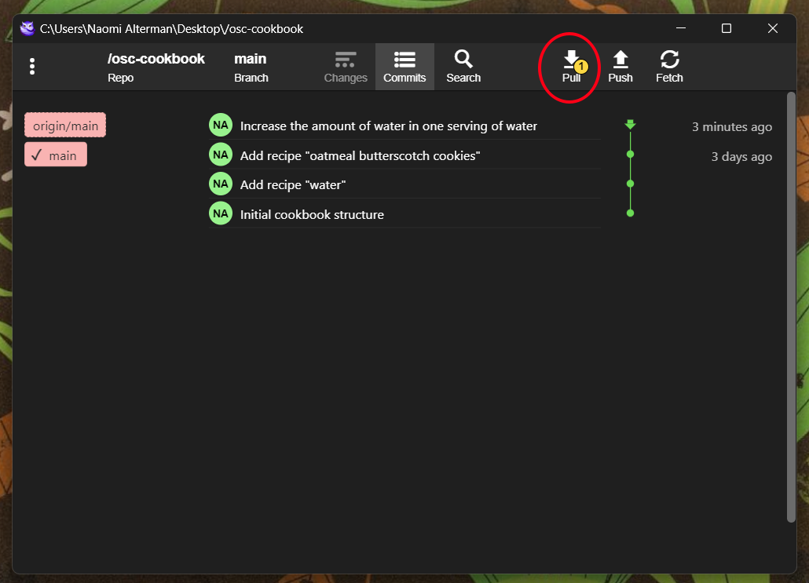
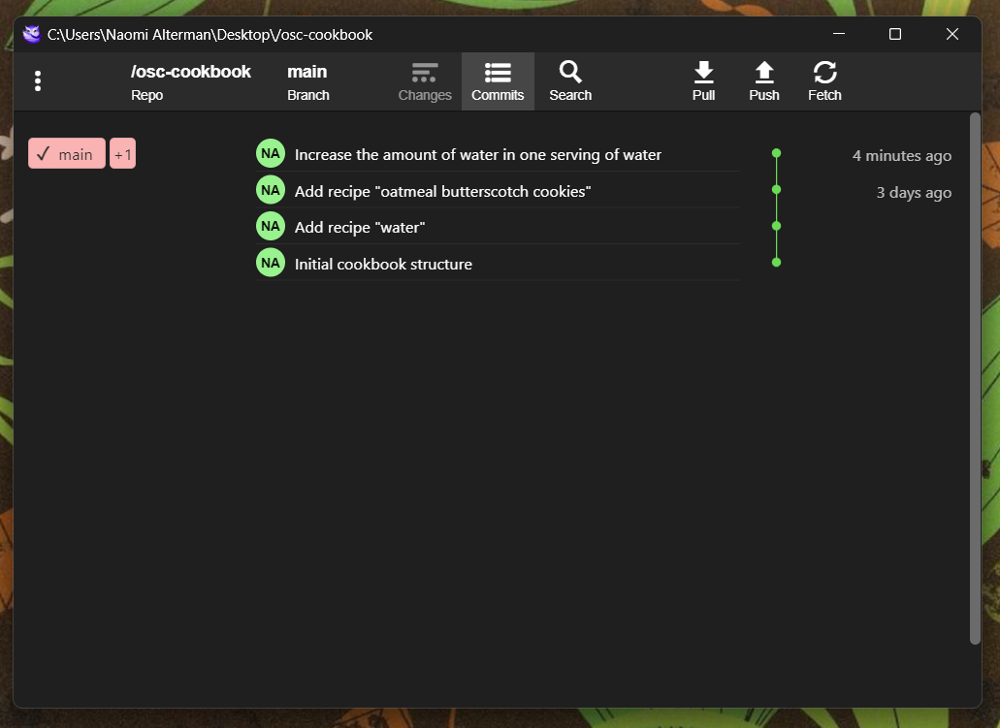

# 5. Pushing and pulling

In this chapter, we'll take the changes we just made and back them up to our cookbook fork on GitHub. Finally, we'll request that the cookbook editor merge our changes into the official cookbook repository so that everyone can see them.

## Timeline discrepancies

Let's another take a look at the commit timeline for the cookbook we just added a commit to:

Notice that there are two post-it notes on the left now, `main` and `origin/main` (pronounced "origin main"). The former is aligned with our new commit, while the latter is still on the previous one. As with the branches we created in the previous chapters of this tutorial, there are now multiple timelines:

1. The `main` timeline on our computer's local copy of the repository, which contains the whole cookbook history *as well as* the new commit containing our contributions
2. The timeline stored remotely on GitHub, `origin/main` which is not yet aware of our new contributions. Because this remote copy is considered the "authoritative" source of the cookbook's history, one that anyone can view, it is referred to as the "origin". Hence, "origin main".

## Pushing changes

To make the main timeline hosted on GitHub aware of our changes, we need to upload them to GitHub's servers. This is called **pushing** our changes. In GitFiend, we can do this by clicking the button with the "upward arrow" icon in the top right. Sometimes it's labelled 'Publish', sometimes it's labelled 'Push'. The author of this tutorial isn't sure why. Either way, it's circled in red below. Give it a click:

Once you do, you'll notice the branch post-its on the left change. They are now both aligned with the new commit we made. Your GitHub repo and your local repo are now synced.

If you go back to your web browser and refresh your repo's page, you should see those changes reflected on the web as well:

## Pull requests

We could just keep modifying our fork of the cookbook and link our friends to it, but if we want our contributions to show up on the original repository we copied from, we'll have to ask the original repo's owner to review our changes. This process is called **issuing a pull request**, because we're effectively requesting that the original repo author pull our changes into their timeline.

On your forked repo's webpage, click the 'Contribute' button (1) and then 'Open pull request' (2):

This will lead us to a page that lets us compose a message to our colleagues, explaining to them what our changes contain:

Note that you can write markdown-formatted text in the description box, if your justification could benefit from bulleted lists and section headers and things like that :) . Once you're ready, click the 'Create pull request' button.

You'll be brought to the official page for your pull request:

You can view the changes being requested under the 'Commits' and 'Files changed' tabs, and discuss the changes with your colleagues using the commend box. Ultimately, however, the owner of the original repository will need to look at the request and approve it for the changes to appear in the authoritative repo.

## Fetching others' changes

What happens if someone *else* gets their contributions pulled into the original repository? How do we get those changes reflected on our computer?

GitHub will notify us that our fork is "behind" the original repository. If we click `Sync fork` (1) and then `Update branch` (2), we'll pull the changes from the original repo into our fork:

Then, back in GitFiend, we'll notice that the `origin/main` branch contains commits that our local `main` does not. We can click the 'Pull' button (circled in red) to pull those changes down to our local copy of the repository:

Doing so will reflect the changes in our local timeline:

